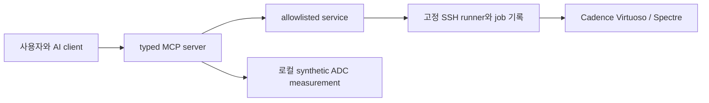

# Cadence MCP Bridge

AI 에이전트의 요청을 제한된 MCP 도구로 받아, 레거시 Cadence Virtuoso/Spectre 환경의
고정된 검증 작업과 구조화된 결과 조회에 연결하는 브리지입니다. 사람이 반복하던 작업을
추적 가능한 job과 좁은 실행 계약으로 묶되, 에이전트가 임의 회로·명령·PDK를 열거나
수정하는 인터페이스는 제공하지 않습니다.

**현재 상태:** 공개 저장소이며 [v1.0.0](https://github.com/Phjrab/cadence-mcp-bridge/releases/tag/v1.0.0)이
2026-08-31 발행되었습니다. 후속 WP-14는 `blocked` 상태입니다. 현재 저장소 runner 후보
`0.19.0`의 원격 배포 성공은 확인되지 않았고, 마지막 문서상 원격 관측은 `0.18.0`입니다.
상세한 근거와 포트폴리오용 설명은 [PORTFOLIO](docs/PORTFOLIO.md)에 정리했습니다.

## 1분 요약

| 질문 | 답 |
|---|---|
| 왜 만들었나 | 레거시 EDA 환경의 반복 검증을 AI 도구와 연결하면서 실행 범위와 결과 출처를 고정하기 위해서입니다. |
| AI의 역할 | 사용자가 허용한 typed tool을 호출하고 반환된 구조화 결과를 해석합니다. 실행·allowlist·감사·복구는 결정적 서비스와 runner가 담당합니다. |
| 확인된 범위 | v1의 job lifecycle, metadata discovery, 고정 profile, synthetic ADC 계산, 승인된 복사본의 제한된 속성 검증입니다. |
| 아직 남은 것 | WP-14의 조건·revision·증거 갱신과 별도 원격 승인입니다. 자유로운 parameter sweep이나 전체 회로 자동 설계는 완료 기능이 아닙니다. |



## 기능과 검증 근거

| 범주 | 구현·증거 | 해석 범위 |
|---|---|---|
| MCP 인터페이스 | 현재 [`server.py`](src/cadence_mcp_bridge/server.py)에 22개 typed tool 등록 | 범용 shell·SKILL 실행기가 아님 |
| 시뮬레이션 job | 고정 smoke 제출·상태·로그·결과·취소 계약 ([Architecture](docs/ARCHITECTURE.md)) | 제출과 회로 타당성 검증은 별개 |
| Profile | fixture RC와 고정 actual differential amplifier profile ([Operations](docs/OPERATIONS.md)) | actual은 임의 변수·분석·sweep을 받지 않음 |
| Measurement | `adc-synthetic-v1` 계산 계약 ([측정 명세](docs/ADC_MEASUREMENT_CONTRACTS.md)) | synthetic 입력이지 실제 ADC 회로 측정이 아님 |
| Controlled write | 과거 V4의 복사본 단일 속성·backup·diff·rollback 18개 수용 기준 기록 ([정책](docs/DESIGN_WRITE_POLICY.md)) | 전체 회로 설계·최적화 성능 지표가 아님 |
| WP-14 | 로컬 구현과 `LOCAL_RULE_READY` 기록 ([상태](PROJECT_STATE.md)) | 원격 0.19.0 배포·preflight·과학적 baseline 승인 아님 |

과거 실환경 기록과 현재 로컬 확인을 구별해야 합니다. WP-14 첫 narrow deployment는
preflight transport에서 멈췄으며 원인은 확정되지 않았습니다
([실패 기록](docs/WP14_NARROW_DEPLOYMENT_RESULT_V2.md)). `0.300 V / 0.650 V`는 조건부
선택이고 별도 연구 후보 `0.370 V / 0.650 V`와 합쳐 현재 ADE baseline으로 취급하지
않습니다. 기존 원격 증거의 유효 경계는 2026-09-18 08:05:01 UTC였습니다.

## AI 활용과 기여 근거

제품 내부 AI는 제한된 tool을 선택·호출하고 결과를 읽는 client 측에 있습니다. 서버의
허용 목록, 실행, 측정식, 감사와 실패 중단은 결정적 코드입니다. 개발 과정의 AI 보조와
개인별 설계·검증 분담은 커밋 작성자나 모델 권장 문구만으로 확정하지 않습니다.
확인 가능한 작업 기록과 추가로 확인할 항목은 [PORTFOLIO](docs/PORTFOLIO.md)를 보세요.

## 문서 길잡이

- [포트폴리오 설명·증거·촬영 목록](docs/PORTFOLIO.md)
- [현재 작업 상태](PROJECT_STATE.md)와 [현재 단계 계획](docs/CURRENT_PHASE_PLAN.md)
- [아키텍처](docs/ARCHITECTURE.md), [운영](docs/OPERATIONS.md), [Codex 연결](docs/CODEX_DESKTOP.md)
- [검증 환경의 당시 기록](docs/VERIFIED_ENVIRONMENT.md), [보안 경계](docs/SECURITY.md)
- [릴리스 및 설치](docs/RELEASE.md), [v1.0.0 릴리스 노트](docs/RELEASE_NOTES_v1.0.0.md)

공개 저장소라고 해서 재사용 허가가 부여된 것은 아닙니다. `pyproject.toml`의
`Proprietary` 분류와 라이선스 파일 부재를 확인하고 사용 권한을 소유자에게 문의하세요.

## 초기 구축 이력

기존 starter bundle 추출과 WP-00 private-repository bootstrap은 2026년 초기 구축 절차로
이미 완료되었습니다. 새 사용자의 설치 절차가 아닙니다. 각 WP의 개발·승인 흐름은
[`CODEX_MASTER_PROMPT.md`](CODEX_MASTER_PROMPT.md)와 [릴리스 문서](docs/RELEASE.md)를 보세요.

## Verified target

- Windows 11, Codex Desktop, VMware Workstation Pro
- SSH alias: `cadence-vm`
- Remote: CentOS 6.5 i686, user `buet`
- Remote work root: `/home/buet/cds_work`
- Virtuoso: IC6.1.5.500.15
- Spectre: 12.1.0.347.isr3
- OCEAN available
- Passwordless SSH verified
- Headless Spectre smoke simulation verified with exit code 0

See `docs/VERIFIED_ENVIRONMENT.md` for the full evidence baseline.

## Windows development and stdio server

WP-01 targets Python 3.12 and uses `uv` for reproducible environments:

```powershell
uv sync --all-groups
uv run ruff check .
uv run mypy src
uv run pytest
uv run python -m cadence_mcp_bridge --help
```

Run the MCP SDK v2 server over stdio with no command, or explicitly with `serve`:

```powershell
uv run python -m cadence_mcp_bridge
uv run python -m cadence_mcp_bridge serve
```

The server exposes the six lifecycle tools plus three metadata-only discovery tools,
`cadence_list_libraries`, `cadence_list_cells`, and `cadence_inspect_cellview`. Discovery is
restricted to a reviewed library/cell/view allowlist and never returns paths or proprietary file
content. It also exposes `cadence_list_profiles`, `cadence_get_profile`, and
`cadence_submit_profile`. The registry keeps the synthetic `fixture-rc-transient` profile separate
from the fixed `actual-differential-amplifier-tb2-transient` ADE L profile. Eight additional
read-only tools cover the versioned synthetic ADC contract, power, offset, settling, FFT metrics,
linearity, corner comparison, and Monte Carlo summary. The actual profile has no caller-controlled
variables, paths, scripts, analyses, or outputs. Register the
reviewed server with `.\scripts\install-codex-mcp.ps1`, then follow
`docs/CODEX_DESKTOP.md` for restart, `/mcp`, approval, and acceptance prompts. See
`docs/ARCHITECTURE.md` for the current boundaries.

See `docs/ADC_MEASUREMENT_CONTRACTS.md` for the exact WP-10 units, formulas, FFT policy,
reproducibility manifest, and the inputs still required before any actual ADC circuit is measured.

WP-11 includes a fixed read-only plan tool and one exact confirmation-gated write-validation tool.
Historical V1/V2/V3 evidence remains preserved. The separately approved V4 clean validation passed
all 18 plan criteria under runner 0.16.0: copy, non-mutating dry-run, backup, one bounded property
apply, exact semantic/metadata diff verification, rollback, baseline restoration, immutable
manifest, audit, and Source/PDK/prior-evidence immutability. This was the validation preceding
the published v1.0.0 release. See `docs/DESIGN_WRITE_POLICY.md` for the dated evidence and
`docs/RELEASE.md` for the published release and operator steps.

Run the reviewed MCP-to-Spectre health and smoke lifecycle verification with:

```powershell
.\scripts\verify-e2e.ps1
```

Run the WP-07 security gate and the non-destructive 30-day retention preview with:

```powershell
.\scripts\verify-security.ps1
.\scripts\cleanup-remote-jobs.ps1
```

The cleanup command is always a dry run. It has no delete mode and never accepts a path.
